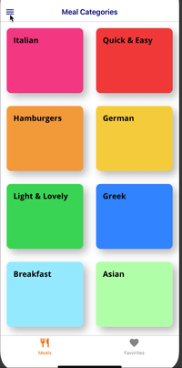
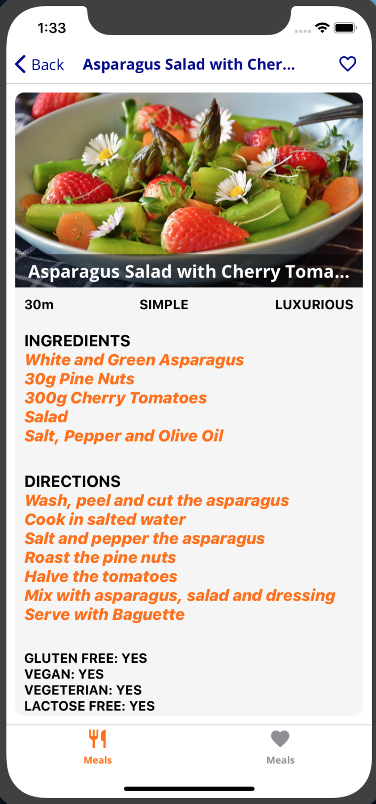

This is a Udemy course
[React Native - The Practical Guide](https://www.udemy.com/react-native-the-practical-guide/)

# Sections:

### 6. Navigation with React Navigation [THE MEALS APP]

### 7. State Management & Redux

It's a small app, where you may choose your meal (which includes the recipie and extra info), add it to favorites, check some preferences (like Gluten-free or Vegetarian) etc.

# Packages installed:

### For Section 6:

### expo-fonts

## Packages for using expo with React Navigation:

### react-navigation

### react-native-gesture-handler

### react-native-reanimated

Note: `expo install react-native-gesture-handler react-native-reanimated` `expo install` behind the sceens will run `npm install` but it will pick the specifiek versions for our expo version.

### react-native-screens

Note: commit _react-native-screens installed_ for using native screen components.
It should be included in expo though.

### react-native-gesture-handler

### react-native-reanimated

### react-navigation-header-buttons

### @expo/vector-icons

### react-navigation-material-bottom-tabs

### react-native-paper

### For Section 7:

### redux react-redux

### react-redux

---

- [124][ctrl + space not working! (fixed on mac os)](https://www.udemy.com/course/react-native-the-practical-guide/learn/lecture/15674806#questions/8053648)

- [130] You can have more than one items = icons. But use different title!

```js
<HeaderButtons HeaderButtonComponent={HeaderButton}>
  {/* You can have more than one items = icons. But use different title! */}
  {/* TODO: change the icon to 'favorite' when clicked */}
  <Item
    title="Favorite"
    iconName={isFavorite ? "favorite" : "favorite-border"}
    onPress={toggleFavorite}
  />
  {/* <Item title="Favorite" iconName="ios-star-outline" onPress={() => console.log('Mark as favorite')} /> */}
</HeaderButtons>
```

## Branches:

Branches are used to try out alternative ways to configure the app,
which the instructor didn't implement.

### For Section 6:

### 1-creatBottomTabNavigator-experiment

Check this post on Stackoverflow [How to set navigationsOptions for two tabs and check the routeName to config the different iconNames?](https://stackoverflow.com/questions/57769242/how-to-set-navigationsoptions-for-two-tabs-and-check-the-routename-to-config-the)

See how the icons and their color change...


### 2-show-different-menu-icon-for-android

> Section: 6, 132
>
> @5:30 Max (the instructor) suggests to use the `Platform` API to set a different icon for android/iOS.

I think the 3 dots are more common for android.

I had to create an extra `AndroidHeaderButton` though, because the 3 dots icon was from a different set of icons.


### 3-config-drawer

I added icons to every item...



### 4-config-detailsScreen-attempt

Display all the info about the recipe. It's an attempt to write the code before the instructor.



### 5-other-dependecies-for-useEffect

#### Check commit "simpler useEffect in FiltersScreen"

This is something I tried out after the instructors way. But it seams simpler and more
concise.

### 6-define-meal-constructor-with-one-argument

#### Check commit: "Meal constructor with one argument".

_I also posted a question in the Q&A of the course:_

### How about passing one argument (an object) in the Meal class/function?

Fotis · Lecture 121

Hello Max,

Please allow me to share my thoughts :)

To start with, I was surprised with the amount of the arguments we have to pass to the Meal constructor. Then a label appeared on the screen (@1:19) saying to use the same order, otherwise the dummy-data won't work.

After some googling I've found this article: "[Six reasons to define constructors with only one argument](https://gcanti.github.io/2014/09/25/six-reasons-to-define-constructors-with-only-one-argument.html)".

On my attempt to implement the Meal by passing an obj as an argument, the following came out, which works fine.

meal.js

````

function Meal(info){
this.id = info.id;
this.categoryIds = info.categoryIds;
this.title = info.title;
this.affordability = info.affordability;
this.complexity = info.complexity;
this.imageUrl = info.imageUrl;
this.duration = info.duration;
this.ingredients = info.ingredients;
this.steps = info.steps;
this.isGlutenFree = info.isGlutenFree;
this.isVegan = info.isVegan;
this.isVegetaria = info.isVegetaria;
this.isLactoseFree = info.isLactoseFree;
}
export default Meal;

```

dummy-data.js

```

...
export const MEALS = [
new Meal({
id: 'm1',
categoryIds: [ 'c1', 'c2' ],
title: 'Spaghetti with Tomato Sauce',
affordability: 'affordable',
complexity: 'simple',
imageUrl: 'https://upload.wikimedia.org/wikipedia/commons/thumb/2/20/Spaghetti_Bolognese_mit_Parmesan_oder_Grana_Padano.jpg/800px-Spaghetti_Bolognese_mit_Parmesan_oder_Grana_Padano.jpg',
duration: 20,
ingredients: [ '4 Tomatoes', '1 Tablespoon of Olive Oil', '1 Onion', '250g Spaghetti', 'Spices', 'Cheese (optional)' ],
steps: [
'Cut the tomatoes and the onion into small pieces.',
'Boil some water - add salt to it once it boils.',
'Put the spaghetti into the boiling water - they should be done in about 10 to 12 minutes.',
'In the meantime, heaten up some olive oil and add the cut onion.',
'After 2 minutes, add the tomato pieces, salt, pepper and your other spices.',
'The sauce will be done once the spaghetti are.',
'Feel free to add some cheese on top of the finished dish.'
],
isGlutenFree: false,
isVegan: true,
isVegetarian: true,
isLactoseFree: true
}),

    new Meal({
        affordability: 'affordable',
        id: 'm2',
        categoryIds: [ 'c2' ],
        title: 'Toast Hawaii',
        complexity: 'simple',
        imageUrl: 'https://cdn.pixabay.com/photo/2018/07/11/21/51/toast-3532016_1280.jpg',
        duration: 10,
        ingredients: [ '1 Slice White Bread', '1 Slice Ham', '1 Slice Pineapple', '1-2 Slices of Cheese', 'Butter' ],
        steps: [
            'Butter one side of the white bread',
            'Layer ham, the pineapple and cheese on the white bread',
            'Bake the toast for round about 10 minutes in the oven at 200°C'
        ],
        isGlutenFree: false,
        isVegan: false,
        isVegetarian: false,
        isLactoseFree: false
    }),

...

```

In the article are mentioned some pros and cons, like:

- the order doesn't matter...

- code is more verbose, but code is read more than written.

- the object approach is a better choice when extreme performance is not required.

Anyway, I would like also your opinion on this, if you don't mind.

Thanks :)

=============================================================

Jost Schmithals
Jost — Teaching Assistant
Hi!

In general these are the options for passing parameters in JavaScript:

- Passing single parameters is the shortest notation, but you have to always remember the proper order of parameters.

```

const area1 = (width, height) => width \* height;
console.log(area1(3, 5));

```

- When passing an options object, the parameters can be passed in an arbitrary order, but we have to introduce a named object which is verbose and can be confusing.

```

const area2 = (dimensions) => dimensions.width \* dimensions.height;
console.log(area2({ height: 5, width: 3 }));

```

- Using object destructuring combines the best of both worlds: A concise syntax and an arbitrary parameters order.

```

const area3 = ({ height, width }) => width \* height;
console.log(area3({ height: 5, width: 3 }));

```

Jost

===================================================================

Fotis Tsakiris
Fotis · 2 days ago
Hi Jost,

Thanks for clearing it out for me.

Yes, object destructuring is combining both worlds.

I'll keep that in mind.

Thanks again!

Happy coding :)

### For Section 7:

### 7-dispatch-setFilters-when-switching

#### Check commit: just switch and save - no save icon
```
````
