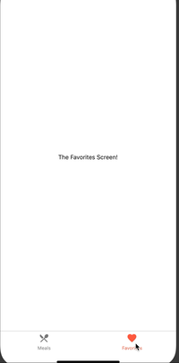

### 1-createBottomTabNavigator-experiment
Check this post on Stackoverflow [How to set navigationsOptions for two tabs and check the routeName to config the different iconNames?](https://stackoverflow.com/questions/57769242/how-to-set-navigationsoptions-for-two-tabs-and-check-the-routename-to-config-the)

See how the icons change...

